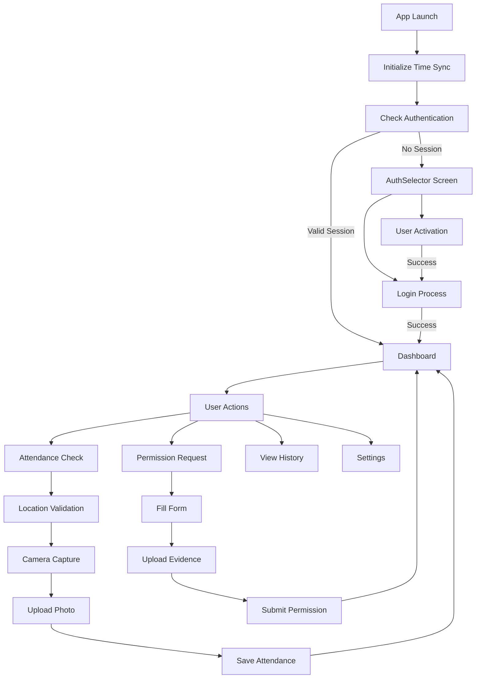
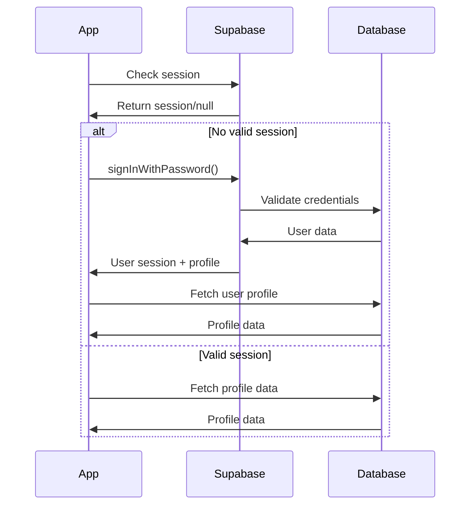
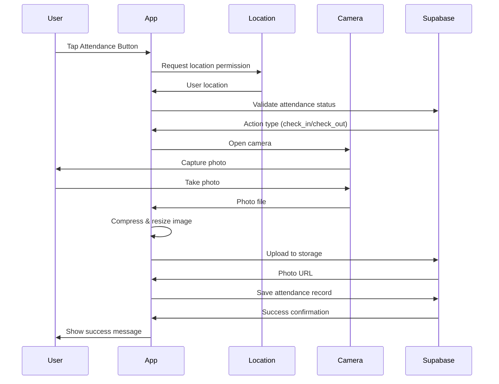

# Dokumentasi Komprehensif Skanida Apps Mobile

## Table of Contents

1. [Overview Arsitektur Sistem](#1-overview-arsitektur-sistem)
2. [Teknologi yang Digunakan](#2-teknologi-yang-digunakan)
3. [Diagram Alur Kerja Aplikasi](#3-diagram-alur-kerja-aplikasi)
4. [Modul dan Fungsi Utama](#4-modul-dan-fungsi-utama)
5. [Dependensi dan Library](#5-dependensi-dan-library)
6. [Konfigurasi dan Environment Setup](#6-konfigurasi-dan-environment-setup)
7. [API Endpoints dan Interface](#7-api-endpoints-dan-interface)
8. [Database Schema](#8-database-schema)
9. [Contoh Penggunaan](#9-contoh-penggunaan)
10. [Deployment Instructions](#10-deployment-instructions)
11. [Troubleshooting Guide](#11-troubleshooting-guide)

---

## 1. Overview Arsitektur Sistem

### 1.1 Deskripsi Sistem

**Skanida Apps Mobile** adalah sistem absensi sekolah berbasis React Native yang dikembangkan khusus untuk SMKN2 Magelang. Aplikasi ini menggunakan pendekatan location-based attendance dengan validasi geografis, sistem waktu tersinkronisasi, dan dokumentasi foto untuk memastikan keakuratan proses absensi.

### 1.2 Arsitektur Umum

```
┌─────────────────────────────────────────────────────────┐
│                    Skanida Apps Mobile                   │
├─────────────────────────────────────────────────────────┤
│  Presentation Layer (React Native + Expo SDK 53)       │
│  ├── UI Components (NativeWind + shadcn/ui)            │
│  ├── Navigation (Expo Router)                          │
│  └── State Management (Zustand)                        │
├─────────────────────────────────────────────────────────┤
│  Business Logic Layer                                  │
│  ├── Time Sync Engine                                  │
│  ├── Location Validator                                │
│  ├── Camera Handler                                    │
│  └── Authentication Manager                            │
├─────────────────────────────────────────────────────────┤
│  Data Layer                                            │
│  ├── Supabase Client (Auth + Database + Storage)      │
│  ├── AsyncStorage (Local Persistence)                  │
│  └── SecureStore (Configuration)                       │
├─────────────────────────────────────────────────────────┤
│  External Services                                     │
│  ├── Supabase Backend (PostgreSQL)                    │
│  ├── Sentry (Error Monitoring)                        │
│  ├── EAS Build (CI/CD)                                │
│  └── OTA Updates                                       │
└─────────────────────────────────────────────────────────┘
```

### 1.3 Karakteristik Utama

- **Platform**: React Native (iOS & Android)
- **Database**: PostgreSQL dengan Supabase
- **Storage**: Supabase Storage (Attendance Photos, Permits, Avatars)
- **Authentication**: Supabase Auth dengan auto profile creation
- **Location Services**: Expo Location dengan mock detection
- **Camera**: React Native Vision Camera + Expo Image Picker
- **State Management**: Zustand dengan persistence
- **Styling**: NativeWind (Tailwind CSS untuk React Native)
- **Time Zone**: Indonesia (WIB/UTC+7)

---

## 2. Teknologi yang Digunakan

### 2.1 Frontend Stack

| Technology | Version | Purpose |
|------------|---------|---------|
| React Native | 0.79.5 | Core framework |
| Expo SDK | 53.0.23 | Development platform |
| TypeScript | ~5.8.3 | Type safety |
| NativeWind | 4.1.21 | Styling (Tailwind CSS) |
| Expo Router | ~5.1.7 | File-based routing |
| Zustand | ^5.0.4 | State management |
| React Native Vision Camera | ^4.7.2 | Camera functionality |

### 2.2 Backend & Services

| Service | Technology | Purpose |
|---------|------------|---------|
| Database | PostgreSQL (Supabase) | Primary data storage |
| Auth | Supabase Auth | User authentication |
| Storage | Supabase Storage | File uploads (photos) |
| Error Monitoring | Sentry | Error tracking & session replay |
| CI/CD | EAS Build | Automated builds |
| OTA Updates | Expo Updates | Over-the-air updates |

### 2.3 Development Tools

| Tool | Version | Purpose |
|------|---------|---------|
| ESLint | ^9.27.0 | Code linting |
| Prettier | ^3.5.3 | Code formatting |
| TypeScript | ~5.8.3 | Type checking |
| Metro | - | JavaScript bundler |

---

## 3. Diagram Alur Kerja Aplikasi

### 3.1 Flowchart Utama



### 3.2 Authentication Flow



### 3.3 Attendance Process Flow



---

## 4. Modul dan Fungsi Utama

### 4.1 Authentication Module

#### 4.1.1 AuthSelector (`app/auth/AuthSelector.tsx`)

**Fungsi**: Landing screen untuk pemilihan masuk atau daftar
**Fitur Utama**:

- Tampilan logo dan branding
- Tombol Masuk dan Daftar
- Exit confirmation untuk back button
- Responsive design dengan dark mode support

#### 4.1.2 Login (`app/auth/Login.tsx`)

**Fungsi**: Proses autentikasi pengguna
**Fitur Utama**:

- Email dan password validation
- Role-based access control (admin blocked)
- Password visibility toggle
- Error handling dengan pesan informatif
- Navigation ke activation atau reset password

#### 4.1.3 User Activation (`app/auth/Activate.tsx`)

**Fungsi**: Aktivasi akun siswa baru dengan NIS
**Fitur Utama**:

- NIS validation against master data
- User profile creation
- Automatic biodata linking
- Activation status tracking

### 4.2 Dashboard Module

#### 4.2.1 Main Dashboard (`app/Dashboard.tsx`)

**Fungsi**: Central hub untuk semua aktivitas pengguna
**Fitur Utama**:

- Real-time attendance status
- User profile display dengan avatar
- Quick action buttons (Attendance, History, Permissions, Settings)
- Live time sync dengan server
- Location-based validation status
- Work hours calculation

**State Management**:

```typescript
interface DashboardState {
  currentTime: Date;
  profileData: UserProfile | null;
  attendanceStatus: AttendanceStatus;
  validationStatus: ValidationStatus;
  attendanceSchedule: AttendanceSchedule | null;
}
```

### 4.3 Attendance Module

#### 4.3.1 Absence Report (`app/attendance/AbsenceReport.tsx`)

**Fungsi**: Validasi dan preparation untuk absensi
**Fitur Utama**:

- Location permission handling
- Mock location detection
- RPC call untuk validasi status absensi
- Automatic navigation ke camera jika valid
- Error handling dengan retry mechanism

**Location Validation Process**:

1. Request foreground location permission
2. Get current position dengan high accuracy
3. Detect mock locations
4. Calculate distance to school
5. Call `get_and_validate_attendance_action` RPC
6. Navigate to camera jika actionable

#### 4.3.2 Camera Attendance (`app/attendance/CameraAttendance.tsx`)

**Fungsi**: Camera capture dan upload absensi
**Fitur Utama**:

- Front/back camera switching
- Real-time capture dengan overlay
- Image compression dan resizing
- Progress tracking untuk upload
- Automatic retry mechanism
- Success popup dengan processing time

**Image Processing Pipeline**:

```typescript
// 1. Capture photo
const photo: PhotoFile = await cameraRef.current.takePhoto();

// 2. Compress image (800px width, 70% quality)
const compressed = await compressImage(photoUri);

// 3. Convert to blob
const fileBlob = base64ToBlob(compressed.base64);

// 4. Upload to Supabase Storage
const photoUrl = await uploadToStorage(fileName, fileBlob);

// 5. Save attendance record
await supabase.rpc('save_attendance_record', {
  p_user_id: user.id,
  p_action_type: actionType,
  p_photo_path: photoUrl,
  p_latitude: resolvedLocation.latitude,
  p_longitude: resolvedLocation.longitude
});
```

### 4.4 Permission Module

#### 4.4.1 Permission Request (`app/perizinan/izin.tsx`)

**Fungsi**: Pengajuan izin sakit atau pergi
**Fitur Utama**:

- Multi-step form dengan validation
- Image upload dari camera atau gallery
- Real-time character counter (10-500 chars)
- One submission per day enforcement
- Progress indicators
- File size validation (max 10MB)

**Form Structure**:

```typescript
interface FormData {
  category: "sakit" | "pergi";
  description: string;
  image: ImageData | null;
}

interface ImageData {
  uri: string;
  fileSize: number;
}
```

### 4.5 Time Synchronization Module

#### 4.5.1 Time Sync Engine (`utils/timeSync.ts`)

**Fungsi**: Sinkronisasi waktu dengan server untuk akurasi absensi
**Fitur Utama**:

- Multi-source time sync (Server → NTP → Local)
- Persistent offset caching
- Drift detection (5-second threshold)
- Background sync setiap 15 menit
- Network delay compensation

**Sync Strategy**:

```typescript
// Primary: Supabase Edge Function (timesync)
await supabase.functions.invoke('timesync');

// Fallback: WorldTimeAPI
const response = await fetch('https://worldtimeapi.org/api/timezone/Asia/Jakarta');

// Last resort: Local device time
const offset = 0;
```

### 4.6 State Management Stores

#### 4.6.1 Auth Store (`store/authStore.ts`)

**Fungsi**: Manajemen state authentication dan user profile
**State Properties**:

```typescript
interface AuthState {
  user: User | null;
  userProfile: UserProfile | null;
  setUser: (user: User | null) => void;
  fetchUserProfile: (userId: string) => Promise<void>;
  logout: () => Promise<void>;
}
```

**Features**:

- Automatic profile fetch dengan retry logic (5 attempts)
- Session persistence
- Profile validation

#### 4.6.2 Theme Store (`store/themeStore.ts`)

**Fungsi**: Manajemen tema aplikasi (light/dark/system)
**Features**:

- Persistence dengan AsyncStorage
- Dynamic theme switching
- System preference detection

#### 4.6.3 Time Sync Store (`store/timeSyncStore.ts`)

**Fungsi**: State management untuk time synchronization
**State Properties**:

```typescript
interface TimeSyncState {
  status: "idle" | "syncing" | "synced" | "failed";
  lastSyncTime: number | null;
  offset: number;
  driftDetected: boolean;
  syncSource: "server" | "ntp" | "local";
  error: string | null;
}
```

### 4.7 Utility Modules

#### 4.7.1 Supabase Client (`utils/supabase.ts`)

**Fungsi**: Konfigurasi dan initialization Supabase client
**Features**:

- Lazy async initialization
- Secure configuration loading
- Automatic token refresh
- Session persistence

#### 4.7.2 Secure Config (`utils/secureConfig.ts`)

**Fungsi**: Manajemen konfigurasi sensitif
**Storage Hierarchy**:

1. SecureStore (priority)
2. AsyncStorage (fallback)
3. Environment variables (last resort)

#### 4.7.3 Time Utilities (`lib/utils.ts`)

**Fungsi**: Helper functions untuk timezone handling
**Functions**:

- `toWIB()`: Convert UTC to WIB untuk display
- `formatDateWIB()`: Format date untuk database queries

### 4.8 UI Components

#### 4.8.1 Core Components

**Button (`components/ui/button.tsx`)**:

- Multiple variants (default, destructive, outline, secondary, ghost, link)
- Size options (default, sm, lg, icon)
- Platform-specific styling

**Text (`components/ui/text.tsx`)**:

- Typographic variants (h1, h2, h3, h4, p, etc.)
- Context-based styling
- Platform-specific roles

**Input (`components/ui/input.tsx`)**:

- Cross-platform input styling
- Dark mode support
- Accessible design

**Card (`components/ui/card.tsx`)**:

- Container components (Card, CardHeader, CardContent, etc.)
- Consistent spacing dan styling

#### 4.8.2 Specialized Components

**Avatar (`components/ui/avatar.tsx`)**:

- Profile picture display
- Fallback initials
- Multiple sizes

**Badge (`components/ui/badge.tsx`)**:

- Status indicators
- Color variants
- Small footprint

**Popup (`components/ui/pop-up.tsx`)**:

- Success notifications
- Attendance confirmations
- Modal overlays

---

## 5. Dependensi dan Library

### 5.1 Core Dependencies

```json
{
  // React Native & Expo
  "react-native": "0.79.5",
  "expo": "^53.0.23",
  "expo-router": "~5.1.7",
  
  // UI & Styling
  "nativewind": "4.1.21",
  "tailwind-merge": "^3.3.0",
  "class-variance-authority": "^0.7.1",
  "clsx": "^2.1.1",
  
  // State Management
  "zustand": "^5.0.4",
  
  // Backend Services
  "@supabase/supabase-js": "2.75.1",
  
  // Hardware Access
  "expo-location": "~18.1.6",
  "expo-camera": "~16.1.11",
  "react-native-vision-camera": "^4.7.2",
  "expo-image-picker": "^16.1.4",
  
  // Error Monitoring
  "@sentry/react-native": "^6.14.0",
  
  // Storage & Cache
  "@react-native-async-storage/async-storage": "2.1.2",
  "expo-secure-store": "~14.2.4",
  
  // Date & Time
  "date-fns": "^4.1.0",
  
  // Navigation
  "@react-navigation/native": "^7.1.6",
  "react-native-screens": "~4.11.1",
  "react-native-safe-area-context": "5.4.0"
}
```

### 5.2 Development Dependencies

```json
{
  // TypeScript
  "typescript": "~5.8.3",
  "@types/react": "~19.0.14",
  
  // Linting & Formatting
  "eslint": "^9.27.0",
  "prettier": "^3.5.3",
  "oxlint": "^1.24.0",
  "@typescript-eslint/eslint-plugin": "^8.32.1",
  "@typescript-eslint/parser": "^8.32.1",
  
  // Build Tools
  "@babel/core": "^7.26.10",
  "tailwindcss": "^3.4.17"
}
```

### 5.3 Key Library Roles

| Library | Category | Purpose | Criticality |
|---------|----------|---------|-------------|
| `expo` | Framework | Development platform | Critical |
| `expo-router` | Navigation | File-based routing | Critical |
| `@supabase/supabase-js` | Backend | Database & auth client | Critical |
| `nativewind` | Styling | Tailwind CSS untuk React Native | Critical |
| `react-native-vision-camera` | Hardware | Camera functionality | Critical |
| `expo-location` | Hardware | GPS location services | Critical |
| `zustand` | State | Global state management | High |
| `date-fns` | Utilities | Date manipulation & formatting | High |
| `@sentry/react-native` | Monitoring | Error tracking | Medium |
| `react-native-gesture-handler` | UI | Touch gestures | Medium |

---

## 6. Konfigurasi dan Environment Setup

### 6.1 Project Configuration

#### 6.1.1 App Configuration (`app.config.ts`)

```typescript
export default ({ config }: ConfigContext): ExpoConfig => ({
  // Basic App Info
  name: "Skanida Apps",
  slug: "skanida-apps-mobile",
  version: "1.1.1-cyrene",
  scheme: "skanida-apps-mobile",
  
  // Updates Configuration
  updates: {
    url: "https://ota.hysilens.my.id/manifest",
    codeSigningMetadata: {
      keyid: "main",
      alg: "rsa-v1_5-sha256",
    },
    codeSigningCertificate: "./certs/certificate.pem",
    enabled: true,
  },
  
  // Plugin Configuration
  plugins: [
    "expo-router",
    "expo-secure-store",
    ["expo-camera", { cameraPermission: "Allow $(PRODUCT_NAME) to access your camera" }],
    ["@sentry/react-native/expo", {
      url: "https://sentry.io/",
      project: "skanida-apps-mobile",
      organization: "geber-suprabapak",
    }],
  ],
  
  // Platform-specific Settings
  ios: {
    supportsTablet: true,
    bundleIdentifier: "com.hfzrk.skanidaappsmobile",
    deploymentTarget: "15.1",
  },
  android: {
    package: "com.hfzrk.skanidaappsmobile",
    permissions: ["android.permission.CAMERA", "android.permission.RECORD_AUDIO"],
  },
});
```

#### 6.1.2 TypeScript Configuration (`tsconfig.json`)

```json
{
  "extends": "expo/tsconfig.base",
  "compilerOptions": {
    "strict": true,
    "baseUrl": ".",
    "paths": {
      "~/*": ["./*"]
    }
  },
  "include": ["**/*.ts", "**/*.tsx"]
}
```

#### 6.1.3 NativeWind Configuration (`tailwind.config.js`)

```javascript
module.exports = {
  content: ["./app/**/*.{js,jsx,ts,tsx}"],
  theme: {
    extend: {
      colors: {
        primary: {
          50: '#eff6ff',
          500: '#3b82f6',
          600: '#2563eb',
        },
        secondary: {
          50: '#f8fafc',
          500: '#64748b',
          600: '#475569',
        }
      }
    }
  },
  plugins: [require("tailwindcss-animate")]
}
```

### 6.2 Environment Variables

#### 6.2.1 Required Environment Variables

```bash
# Supabase Configuration
EXPO_PUBLIC_SUPABASE_URL=your_supabase_url
EXPO_PUBLIC_SUPABASE_ANON_KEY=your_supabase_anon_key

# Sentry Configuration (Optional)
EXPO_PUBLIC_SENTRY_DSN=your_sentry_dsn

# Build Configuration
RELEASE_CHANNEL=production
EAS_PROJECT_ID=your_eas_project_id
```

#### 6.2.2 Configuration Storage Strategy

1. **Runtime Configuration** (SecureStore → AsyncStorage → Environment)
2. **Build-time Configuration** (eas.json environment variables)
3. **Development Configuration** (.env.local file)

### 6.3 EAS Build Configuration

#### 6.3.1 EAS Configuration (`eas.json`)

```json
{
  "cli": {
    "version": ">= 5.0.0"
  },
  "build": {
    "development": {
      "developmentClient": true,
      "distribution": "internal"
    },
    "preview": {
      "distribution": "internal",
      "env": {
        "EXPO_PUBLIC_SUPABASE_URL": "@supabase_url",
        "EXPO_PUBLIC_SUPABASE_ANON_KEY": "@supabase_anon_key"
      }
    },
    "production": {
      "env": {
        "EXPO_PUBLIC_SUPABASE_URL": "@supabase_url",
        "EXPO_PUBLIC_SUPABASE_ANON_KEY": "@supabase_anon_key"
      }
    }
  }
}
```

### 6.4 Development Setup

#### 6.4.1 Prerequisites

```bash
# Node.js
Node.js LTS (18.x or higher)

# Package Manager
pnpm (recommended) or npm

# Development Tools
- Android Studio + Android SDK
- Xcode (for iOS development)
- Java JDK (Adoptium recommended)

# Environment Variables
ANDROID_HOME must be properly configured
```

#### 6.4.2 Installation Steps

```bash
# Clone repository
git clone https://github.com/geber-suprabapak/skanida-apps-mobile.git
cd skanida-apps-mobile

# Install dependencies
pnpm install

# Setup environment variables
cp .env.example .env.local
# Edit .env.local with your Supabase credentials

# Start development server
pnpm start

# Run on device
pnpm android  # Android
pnpm ios      # iOS
```

---

## 7. API Endpoints dan Interface

### 7.1 Supabase RPC Functions

#### 7.1.1 Authentication Functions

**`get_biodata_siswa(p_nis TEXT)`**

```typescript
// Purpose: Validate student NIS during activation
// Returns: Student biodata (nama, nis, kelas, activated)
// Access: Public (no auth required)

const { data } = await supabase.rpc('get_biodata_siswa', {
  p_nis: '12345678'
});

interface StudentBiodata {
  nama: string;
  nis: string;
  kelas: string;
  activated: boolean;
}
```

#### 7.1.2 Attendance Functions

**`check_absensi_status(p_user_id UUID, p_user_lat DOUBLE PRECISION, p_user_lon DOUBLE PRECISION)`**

```typescript
// Purpose: Validate attendance action based on location and schedule
// Returns: Comprehensive validation result
// Access: Authenticated users

const { data } = await supabase.rpc('check_absensi_status', {
  p_user_id: user.id,
  p_user_lat: location.coords.latitude,
  p_user_lon: location.coords.longitude
});

interface AbsensiCheckResult {
  status_code: "VALID" | "OUT_OF_RANGE" | "NOT_SCHEDULED" | "TIME_OUT" | "ALREADY_COMPLETED";
  required_action: "present" | "home" | "none";
  location_name: string;
  distance_m: number;
  message: string;
}
```

**`get_and_validate_attendance_action(p_user_id UUID, p_user_lat DOUBLE PRECISION, p_user_lon DOUBLE PRECISION)`**

```typescript
// Purpose: Determine if user can perform attendance action
// Returns: Action recommendation with details
// Access: Authenticated users

const { data } = await supabase.rpc('get_and_validate_attendance_action', {
  p_user_id: user.id,
  p_user_lat: location.coords.latitude,
  p_user_lon: location.coords.longitude
});

interface AttendanceActionResponse {
  actionable: boolean;
  action_type: "check_in" | "check_out" | "none";
  message: string;
  details: {
    location_name?: string;
    status?: "Hadir" | "Terlambat";
  };
}
```

**`save_attendance_record(p_user_id UUID, p_action_type TEXT, p_photo_path TEXT, p_latitude DOUBLE PRECISION, p_longitude DOUBLE PRECISION)`**

```typescript
// Purpose: Save attendance record to database
// Returns: Success confirmation with record ID
// Access: Authenticated users

const { data } = await supabase.rpc('save_attendance_record', {
  p_user_id: user.id,
  p_action_type: "check_in", // or "check_out"
  p_photo_path: photoUrl,
  p_latitude: coordinates.latitude,
  p_longitude: coordinates.longitude
});

interface SaveResult {
  success: boolean;
  message: string;
  attendance_id: string;
}
```

#### 7.1.3 Location Functions

**`check_nearest_location(user_lat DOUBLE PRECISION, user_lon DOUBLE PRECISION)`**

```typescript
// Purpose: Find nearest active location and calculate distance
// Returns: Location data with distance calculation
// Access: Authenticated users

const { data } = await supabase.rpc('check_nearest_location', {
  user_lat: latitude,
  user_lon: longitude
});

interface LocationCheck {
  location_id: number;
  location_name: string;
  distance_m: number;
  is_within_range: boolean;
}
```

### 7.2 Supabase Edge Functions

#### 7.2.1 Time Sync Function

**Endpoint**: `functions/v1/timesync`

```typescript
// Purpose: Get server time for synchronization
// Method: GET
// Returns: Server time in UTC and UTC+7

const { data } = await supabase.functions.invoke('timesync');

interface ServerTimeResponse {
  serverTime: string;        // ISO string in UTC
  serverTimeUTC7: string;    // ISO string in WIB
  formattedUTC7: string;     // Human readable format
}
```

### 7.3 Database Tables & Interfaces

#### 7.3.1 User Profiles

```sql
CREATE TABLE user_profiles (
    id UUID PRIMARY KEY DEFAULT gen_random_uuid(),
    user_id UUID NOT NULL UNIQUE,
    nis TEXT,
    full_name TEXT,
    email TEXT,
    avatar_url TEXT,
    absence_number TEXT,
    class_name TEXT,
    gender TEXT,
    role TEXT,
    created_at TIMESTAMPTZ DEFAULT NOW(),
    updated_at TIMESTAMPTZ DEFAULT NOW()
);
```

```typescript
interface UserProfile {
  id: string;
  user_id: string;
  nis: string | null;
  full_name: string | null;
  email: string | null;
  avatar_url: string | null;
  absence_number: string | null;
  class_name: string | null;
  gender: string | null;
  role: string | null;
  created_at: string;
  updated_at: string;
}
```

#### 7.3.2 Attendance Records

```sql
CREATE TABLE absences (
    id UUID PRIMARY KEY DEFAULT gen_random_uuid(),
    user_id UUID NOT NULL,
    date DATE NOT NULL,
    reason TEXT,
    photo_url TEXT,
    latitude DOUBLE PRECISION,
    longitude DOUBLE PRECISION,
    status TEXT NOT NULL CHECK (status = ANY (ARRAY['Hadir', 'Terlambat', 'Pulang', 'Alpha'])),
    created_at TIMESTAMPTZ DEFAULT NOW()
);
```

```typescript
interface Absence {
  id: string;
  user_id: string;
  date: string;
  reason: string | null;
  photo_url: string | null;
  latitude: number | null;
  longitude: number | null;
  status: "Hadir" | "Terlambat" | "Pulang" | "Alpha";
  created_at: string;
}
```

#### 7.3.3 Permission Requests

```sql
CREATE TABLE perizinan (
    id UUID PRIMARY KEY DEFAULT gen_random_uuid(),
    user_id UUID NOT NULL,
    tanggal TIMESTAMPTZ DEFAULT NOW(),
    kategori_izin TEXT NOT NULL CHECK (kategori_izin = ANY (ARRAY['sakit', 'pergi'])),
    deskripsi TEXT,
    link_foto TEXT,
    approval_status TEXT DEFAULT 'pending' CHECK (approval_status = ANY (ARRAY['pending', 'approved', 'rejected'])),
    status BOOLEAN DEFAULT FALSE,
    created_at TIMESTAMPTZ DEFAULT NOW()
);
```

```typescript
interface PermissionRequest {
  id: string;
  user_id: string;
  tanggal: string;
  kategori_izin: "sakit" | "pergi";
  deskripsi: string | null;
  link_foto: string | null;
  approval_status: "pending" | "approved" | "rejected";
  status: boolean;
  created_at: string;
}
```

### 7.4 Storage Buckets

#### 7.4.1 Bucket Configuration

```typescript
interface StorageBuckets {
  'attendance-photos': {
    purpose: 'Attendance verification photos';
    privacy: 'Private';
    access: 'Owner read, Auth upload';
  };
  'perizinan': {
    purpose: 'Permission request evidence';
    privacy: 'Private';
    access: 'Owner read, Auth upload';
  };
  'avatars': {
    purpose: 'User profile pictures';
    privacy: 'Private';
    access: 'Owner read/write, Auth upload';
  };
}
```

#### 7.4.2 File Upload Interface

```typescript
// Upload attendance photo
const uploadAttendancePhoto = async (fileBlob: Blob, fileName: string) => {
  const { data, error } = await supabase.storage
    .from('attendance-photos')
    .upload(fileName, fileBlob, {
      contentType: 'image/jpeg',
      upsert: true
    });
  
  if (error) throw error;
  
  // Create signed URL for access
  const { data: signedUrl } = await supabase.storage
    .from('attendance-photos')
    .createSignedUrl(data.path, 60 * 60 * 24 * 30); // 30 days
  
  return signedUrl.signedUrl;
};
```

---

## 8. Database Schema

### 8.1 Entity Relationship Diagram

**Hubungan Utama dalam Database:**

- **auth.users** ↔ **user_profiles** (1:1, user_id)
- **auth.users** ↔ **absences** (1:many, user_id)
- **auth.users** ↔ **perizinan** (1:many, user_id)
- **biodata_siswa** ↔ **user_profiles** (1:1, nis)
- **location** → **absences** (validation reference)
- **jadwal_absensi** → **absences** (schedule reference)

**Tabel Utama:**

1. **user_profiles** - Extended user data
2. **absences** - Attendance records
3. **perizinan** - Permission requests
4. **biodata_siswa** - Master student data
5. **location** - Valid attendance locations
6. **jadwal_absensi** - Daily schedule configuration

### 8.2 Detailed Schema Tables

#### 8.2.1 Core User Tables

**biodata_siswa**

```sql
-- Master data for student registration
CREATE TABLE biodata_siswa (
    nis BIGINT PRIMARY KEY NOT NULL,
    nama TEXT,
    kelas TEXT,
    absen INTEGER,
    kelamin TEXT,
    activated BOOLEAN DEFAULT FALSE NOT NULL
);

-- Indexes
CREATE INDEX idx_biodata_siswa_nis ON biodata_siswa(nis);
CREATE INDEX idx_biodata_siswa_activated ON biodata_siswa(activated);
```

**user_profiles**

```sql
-- Extended user profile data
CREATE TABLE user_profiles (
    id UUID PRIMARY KEY DEFAULT gen_random_uuid() NOT NULL,
    user_id UUID NOT NULL UNIQUE,
    nis TEXT,
    full_name TEXT,
    email TEXT,
    avatar_url TEXT,
    absence_number TEXT,
    class_name TEXT,
    gender TEXT,
    role TEXT,
    created_at TIMESTAMPTZ DEFAULT NOW() NOT NULL,
    updated_at TIMESTAMPTZ DEFAULT NOW() NOT NULL,
    CONSTRAINT fk_user_profiles_user_id 
        FOREIGN KEY (user_id) REFERENCES auth.users(id) ON DELETE CASCADE
);

-- Indexes for performance
CREATE INDEX idx_user_profiles_user_id ON user_profiles(user_id);
CREATE INDEX idx_user_profiles_nis ON user_profiles(nis);
CREATE INDEX idx_user_profiles_email ON user_profiles(email);
CREATE INDEX idx_user_profiles_role ON user_profiles(role);

-- Auto-update trigger
CREATE TRIGGER update_user_profiles_updated_at
    BEFORE UPDATE ON user_profiles
    FOR EACH ROW
    EXECUTE FUNCTION update_updated_at_column();
```

#### 8.2.2 Attendance System

**absences**

```sql
-- Student attendance records
CREATE TABLE absences (
    id UUID PRIMARY KEY DEFAULT gen_random_uuid() NOT NULL,
    user_id UUID NOT NULL,
    date DATE NOT NULL,
    reason TEXT,
    photo_url TEXT,
    latitude DOUBLE PRECISION,
    longitude DOUBLE PRECISION,
    status TEXT NOT NULL,
    created_at TIMESTAMPTZ DEFAULT NOW() NOT NULL,
    CONSTRAINT fk_absences_user_id 
        FOREIGN KEY (user_id) REFERENCES auth.users(id) ON DELETE CASCADE,
    CONSTRAINT absences_status_check 
        CHECK (status = ANY (ARRAY['Hadir'::TEXT, 'Terlambat'::TEXT, 'Pulang'::TEXT, 'Alpha'::TEXT]))
);

-- Indexes
CREATE INDEX idx_absences_user_id ON absences(user_id);
CREATE INDEX idx_absences_date ON absences(date);
CREATE INDEX idx_absences_status ON absences(status);
CREATE INDEX idx_absences_user_date ON absences(user_id, date);
```

**jadwal_absensi**

```sql
-- Schedule configuration for attendance
CREATE TABLE jadwal_absensi (
    id INTEGER PRIMARY KEY,
    hari VARCHAR(20) NOT NULL, -- senin, selasa, rabu, kamis, jumat, sabtu, minggu
    mulai_masuk VARCHAR(8) NOT NULL, -- HH:MM:SS format
    selesai_masuk VARCHAR(8) NOT NULL, -- HH:MM:SS format
    mulai_pulang VARCHAR(8) NOT NULL, -- HH:MM:SS format
    selesai_pulang VARCHAR(8) NOT NULL, -- HH:MM:SS format
    kompensasi_waktu INTEGER DEFAULT 0 NOT NULL, -- in minutes
    is_active BOOLEAN DEFAULT TRUE NOT NULL,
    created_at TIMESTAMP DEFAULT CURRENT_TIMESTAMP,
    updated_at TIMESTAMP DEFAULT CURRENT_TIMESTAMP
);

-- Default schedule data
INSERT INTO jadwal_absensi (id, hari, mulai_masuk, selesai_masuk, mulai_pulang, selesai_pulang, kompensasi_waktu, is_active)
VALUES
    (1, 'senin', '06:30:00', '07:30:00', '15:00:00', '16:00:00', 15, TRUE),
    (2, 'selasa', '06:30:00', '07:30:00', '15:00:00', '16:00:00', 20, TRUE),
    (3, 'rabu', '06:30:00', '07:30:00', '15:00:00', '16:00:00', 15, TRUE),
    (4, 'kamis', '06:30:00', '07:30:00', '15:00:00', '16:00:00', 15, TRUE),
    (5, 'jumat', '06:30:00', '07:30:00', '15:00:00', '12:00:00', 15, TRUE),
    (6, 'sabtu', '06:30:00', '07:30:00', '12:00:00', '13:00:00', 15, FALSE),
    (7, 'minggu', '06:30:00', '07:30:00', '15:00:00', '16:00:00', 15, FALSE);
```

**location**

```sql
-- System configuration for location-based attendance
CREATE TABLE location (
    id INTEGER PRIMARY KEY,
    name VARCHAR(255) NOT NULL,
    longitude DOUBLE PRECISION NOT NULL,
    latitude DOUBLE PRECISION NOT NULL,
    distance INTEGER NOT NULL, -- distance in meters
    is_active BOOLEAN DEFAULT TRUE,
    created_at TIMESTAMP DEFAULT CURRENT_TIMESTAMP,
    updated_at TIMESTAMP DEFAULT CURRENT_TIMESTAMP
);

-- Default school location
INSERT INTO location (id, name, longitude, latitude, distance, is_active)
VALUES (1, 'SMKN2 Magelang', 110.2241, -7.4503, 500, TRUE);
```

#### 8.2.3 Permission System

**perizinan**

```sql
-- Permission/leave requests
CREATE TABLE perizinan (
    id UUID PRIMARY KEY DEFAULT gen_random_uuid() NOT NULL,
    user_id UUID NOT NULL,
    tanggal TIMESTAMPTZ DEFAULT NOW() NOT NULL,
    kategori_izin TEXT NOT NULL, -- sakit, pergi
    deskripsi TEXT,
    link_foto TEXT,
    approval_status TEXT DEFAULT 'pending' NOT NULL,
    status BOOLEAN DEFAULT FALSE NOT NULL,
    created_at TIMESTAMPTZ DEFAULT NOW() NOT NULL,
    updated_at TIMESTAMPTZ DEFAULT NOW() NOT NULL,
    approved_by UUID,
    approved_at TIMESTAMPTZ,
    rejection_reason TEXT,
    rejected_at TIMESTAMPTZ,
    rejected_by TEXT,
    tanggal_utc_date DATE, -- Helper column for date queries
    CONSTRAINT fk_perizinan_user_id 
        FOREIGN KEY (user_id) REFERENCES auth.users(id) ON DELETE CASCADE,
    CONSTRAINT fk_perizinan_approved_by 
        FOREIGN KEY (approved_by) REFERENCES auth.users(id) ON DELETE SET NULL,
    CONSTRAINT perizinan_kategori_izin_check 
        CHECK (kategori_izin = ANY (ARRAY['sakit'::TEXT, 'pergi'::TEXT])),
    CONSTRAINT perizinan_approval_status_check 
        CHECK (approval_status = ANY (ARRAY['pending'::TEXT, 'approved'::TEXT, 'rejected'::TEXT]))
);

-- Indexes
CREATE INDEX idx_perizinan_user_id ON perizinan(user_id);
CREATE INDEX idx_perizinan_tanggal ON perizinan(tanggal);
CREATE INDEX idx_perizinan_approval_status ON perizinan(approval_status);
CREATE INDEX idx_perizinan_tanggal_utc_date ON perizinan(tanggal_utc_date);
CREATE INDEX idx_perizinan_user_day ON perizinan(user_id, tanggal_utc_date);

-- Unique constraint: one permit per user per day
CREATE UNIQUE INDEX perizinan_user_day_unique ON perizinan(user_id, tanggal_utc_date);

-- Auto-update trigger
CREATE TRIGGER update_perizinan_updated_at
    BEFORE UPDATE ON perizinan
    FOR EACH ROW
    EXECUTE FUNCTION update_updated_at_column();

-- Auto-populate tanggal_utc_date
CREATE TRIGGER set_perizinan_tanggal_utc_date_trigger
    BEFORE INSERT OR UPDATE OF tanggal ON perizinan
    FOR EACH ROW
    EXECUTE FUNCTION set_perizinan_tanggal_utc_date();
```

### 8.3 Row Level Security (RLS)

#### 8.3.1 RLS Policies

**User Profiles Policy**

```sql
-- Users can only access their own profile
CREATE POLICY user_profiles_select_own ON user_profiles
    FOR SELECT USING (auth.uid() = user_id);

CREATE POLICY user_profiles_insert_own ON user_profiles
    FOR INSERT WITH CHECK (auth.uid() = user_id);

CREATE POLICY user_profiles_update_own ON user_profiles
    FOR UPDATE USING (auth.uid() = user_id) WITH CHECK (auth.uid() = user_id);
```

**Absences Policy**

```sql
-- Users can only access their own absences
CREATE POLICY absences_select_own ON absences
    FOR SELECT USING (auth.uid() = user_id);

CREATE POLICY absences_insert_own ON absences
    FOR INSERT WITH CHECK (auth.uid() = user_id);

CREATE POLICY absences_update_own ON absences
    FOR UPDATE USING (auth.uid() = user_id) WITH CHECK (auth.uid() = user_id);
```

**Permissions Policy**

```sql
-- Users can only access their own permission requests
CREATE POLICY perizinan_select_own ON perizinan
    FOR SELECT USING (auth.uid() = user_id);

CREATE POLICY perizinan_insert_own ON perizinan
    FOR INSERT WITH CHECK (auth.uid() = user_id);

CREATE POLICY perizinan_update_own ON perizinan
    FOR UPDATE USING (auth.uid() = user_id) WITH CHECK (auth.uid() = user_id);
```

**Location & Schedule Policies**

```sql
-- Everyone can view active locations
CREATE POLICY "Everyone can view active locations" ON location
    FOR SELECT USING (is_active = true);

-- Everyone can view schedule
CREATE POLICY "Everyone can view schedule" ON jadwal_absensi
    FOR SELECT USING (true);
```

### 8.4 Storage Configuration

#### 8.4.1 Storage Buckets

```sql
-- Create storage buckets (private by default)
INSERT INTO storage.buckets (id, name, public) VALUES
    ('attendance-photos', 'attendance-photos', false),
    ('perizinan', 'perizinan', false),
    ('avatars', 'avatars', false);

-- Enable RLS on storage.objects
ALTER TABLE storage.objects ENABLE ROW LEVEL SECURITY;
```

#### 8.4.2 Storage Policies

```sql
-- Owner read policies
CREATE POLICY owner_read_attendance_photos ON storage.objects
    FOR SELECT USING (bucket_id = 'attendance-photos' AND owner = auth.uid());

CREATE POLICY owner_read_perizinan ON storage.objects
    FOR SELECT USING (bucket_id = 'perizinan' AND owner = auth.uid());

CREATE POLICY owner_read_avatars ON storage.objects
    FOR SELECT USING (bucket_id = 'avatars' AND owner = auth.uid());

-- Authenticated upload policies
CREATE POLICY auth_upload_attendance_photos ON storage.objects
    FOR INSERT WITH CHECK (bucket_id = 'attendance-photos' AND auth.role() = 'authenticated');

CREATE POLICY auth_upload_perizinan ON storage.objects
    FOR INSERT WITH CHECK (bucket_id = 'perizinan' AND auth.role() = 'authenticated');

CREATE POLICY auth_upload_avatars ON storage.objects
    FOR INSERT WITH CHECK (bucket_id = 'avatars' AND auth.role() = 'authenticated');
```

---

## 9. Contoh Penggunaan

### 9.1 User Authentication Flow

#### 9.1.1 User Login Example

```typescript
import useAuthStore from '~/store/authStore';

const handleLogin = async () => {
  try {
    setLoading(true);
    const { data, error } = await supabase.auth.signInWithPassword({
      email: userEmail,
      password: userPassword,
    });

    if (error) {
      // Handle different error types
      if (error.message === 'Email not confirmed') {
        Alert.alert('Email belum dikonfirmasi', 
          'Silakan periksa email Anda untuk verifikasi.');
      } else {
        Alert.alert('Login gagal', 
          'Periksa kembali email dan password Anda.');
      }
      return;
    }

    if (data?.user) {
      // Set user in store (triggers profile fetch)
      setUser(data.user);
      router.replace('/Dashboard');
    }
  } catch (error) {
    console.error('Login error:', error);
  } finally {
    setLoading(false);
  }
};
```

#### 9.1.2 User Activation Example

```typescript
const handleActivation = async () => {
  try {
    setLoading(true);
    
    // 1. Validate NIS against master data
    const { data: biodata } = await supabase.rpc('get_biodata_siswa', {
      p_nis: studentId
    });

    if (!biodata || biodata.length === 0) {
      Alert.alert('NIS tidak valid', 
        'Nomor Induk Siswa tidak ditemukan dalam sistem.');
      return;
    }

    if (biodata[0].activated) {
      Alert.alert('Akun sudah diaktifkan', 
        'Akun dengan NIS ini sudah pernah diaktifkan.');
      return;
    }

    // 2. Create Supabase Auth user
    const { data: authData, error: authError } = await supabase.auth.signUp({
      email: email,
      password: password,
      options: {
        data: {
          nis: studentId,
          full_name: biodata[0].nama,
          class_name: biodata[0].kelas
        }
      }
    });

    if (authError) {
      Alert.alert('Gagal aktivasi', authError.message);
      return;
    }

    Alert.alert('Aktivasi berhasil', 
      'Akun Anda telah berhasil diaktifkan. Silakan login dengan email dan password yang sudah dibuat.');
    
    router.replace('/auth/Login');

  } catch (error) {
    console.error('Activation error:', error);
  } finally {
    setLoading(false);
  }
};
```

### 9.2 Attendance Process Example

#### 9.2.1 Location Validation and Check-in

```typescript
const performAttendanceCheck = async () => {
  try {
    // 1. Request location permission
    let { status } = await Location.getForegroundPermissionsAsync();
    if (status !== 'granted') {
      status = (await Location.requestForegroundPermissionsAsync()).status;
    }
    if (status !== 'granted') {
      throw new Error('Izin lokasi ditolak. Absensi tidak dapat dilanjutkan.');
    }

    // 2. Get current location
    const location = await Location.getCurrentPositionAsync({
      accuracy: Location.Accuracy.High,
    });

    // 3. Detect mock location
    if (location.mocked) {
      throw new Error(
        'Terdeteksi lokasi palsu. Matikan pengaturan lokasi palsu untuk melanjutkan.'
      );
    }

    // 4. Validate attendance action
    const { data, error } = await supabase.rpc(
      'get_and_validate_attendance_action',
      {
        p_user_id: user.id,
        p_user_lat: location.coords.latitude,
        p_user_lon: location.coords.longitude,
      }
    );

    if (error) {
      throw new Error(`Gagal memeriksa status: ${error.message}`);
    }

    // 5. Navigate to camera if actionable
    if (data.actionable && data.action_type !== 'none') {
      router.push({
        pathname: '/attendance/CameraAttendance',
        params: {
          actionType: data.action_type,
          latitude: location.coords.latitude.toString(),
          longitude: location.coords.longitude.toString(),
          locationName: data.details?.location_name,
        },
      });
    } else {
      // Show reason why user cannot attend
      Alert.alert('Tidak dapat absen', data.message);
    }

  } catch (error) {
    Alert.alert('Error', error.message);
  }
};
```

#### 9.2.2 Camera Capture and Upload

```typescript
const captureAndUploadPhoto = async () => {
  try {
    setIsCapturingPhoto(true);

    // 1. Capture photo
    const photo: PhotoFile = await cameraRef.current.takePhoto();
    const photoUri = photo.path.startsWith('file://') 
      ? photo.path 
      : `file://${photo.path}`;

    // 2. Compress image
    const compressed = await compressImage(photoUri, {
      width: 800,
      quality: 0.7,
      format: 'jpeg'
    });

    // 3. Upload to storage
    const fileName = generateFileName(user.id);
    const fileBlob = base64ToBlob(compressed.base64);
    const photoUrl = await uploadToStorage(fileName, fileBlob);

    // 4. Save attendance record
    const { data: saveData, error: saveError } = await supabase.rpc(
      'save_attendance_record',
      {
        p_user_id: user.id,
        p_action_type: actionType, // "check_in" or "check_out"
        p_photo_path: photoUrl,
        p_latitude: coordinates.latitude,
        p_longitude: coordinates.longitude,
      }
    );

    if (saveError || !saveData?.success) {
      throw new Error(
        `Gagal menyimpan data: ${
          saveError?.message || saveData?.message || 'Respons tidak valid'
        }`
      );
    }

    // 5. Show success and return to dashboard
    const currentTime = timeSync.getSyncedTime()
      .toLocaleTimeString('id-ID', {
        hour: '2-digit',
        minute: '2-digit',
      });

    router.replace({
      pathname: '/Dashboard',
      params: {
        showSuccessPopup: 'true',
        attendanceType: actionType,
        successTime: currentTime,
      },
    });

  } catch (error) {
    Alert.alert('Error', error.message);
  } finally {
    setIsCapturingPhoto(false);
  }
};
```

### 9.3 Permission Request Example

#### 9.3.1 Form Submission

```typescript
const submitPermissionRequest = async () => {
  try {
    setUploading(true);

    // 1. Validate form
    if (!validation.description) {
      Alert.alert('Error', 'Deskripsi minimal 10 karakter');
      return;
    }

    if (!formData.image) {
      Alert.alert(
        'Error',
        'Foto bukti wajib dilampirkan untuk pengajuan izin.',
      );
      return;
    }

    // 2. Check if user already submitted today
    const hasSubmittedToday = await checkTodayIzin(user.id);
    if (hasSubmittedToday) {
      Alert.alert(
        'Izin Sudah Diajukan Hari Ini',
        'Anda sudah mengajukan izin untuk hari ini. ' +
        'Sistem hanya memperbolehkan satu pengajuan izin per hari.'
      );
      return;
    }

    // 3. Upload image
    const imageUrl = await uploadImageToStorage(formData.image, user.id);

    // 4. Save to database
    await insertPermitToDatabase({
      userId: user.id,
      category: formData.category, // "sakit" or "pergi"
      description: formData.description,
      imageUrl,
    });

    setHasSubmittedToday(true);
    Alert.alert('Success', 'Izin berhasil dikirim');
    router.back();

  } catch (error) {
    Alert.alert('Error', error.message);
  } finally {
    setUploading(false);
  }
};
```

### 9.4 State Management Examples

#### 9.4.1 Auth Store Usage

```typescript
import useAuthStore from '~/store/authStore';

// In component
const { 
  user, 
  userProfile, 
  setUser, 
  fetchUserProfile, 
  logout 
} = useAuthStore();

// Access user data
console.log('User ID:', user?.id);
console.log('User Profile:', userProfile?.full_name);

// Set user (automatically triggers profile fetch)
setUser(authUser);

// Manually fetch profile
await fetchUserProfile(userId);

// Logout
await logout();
```

#### 9.4.2 Time Sync Store Usage

```typescript
import useTimeSyncStore from '~/store/timeSyncStore';

// In component
const { 
  status, 
  offset, 
  driftDetected, 
  syncSource, 
  lastSyncTime 
} = useTimeSyncStore();

// Display sync status
const getSyncStatusText = () => {
  switch (status) {
    case 'synced':
      return 'Waktu tersinkron';
    case 'syncing':
      return 'Menyinkronkan waktu...';
    case 'failed':
      return 'Sinkronisasi gagal';
    default:
      return 'Waktu lokal';
  }
};

// Get current synced time
const currentTime = timeSync.getSyncedTime();

// Force sync
const forceSync = async () => {
  const success = await timeSync.forceSyncWithServer();
  console.log('Force sync result:', success);
};
```

### 9.5 Time Synchronization Examples

#### 9.5.1 Using Time Sync in Components

```typescript
import { timeSync } from '~/utils/timeSync';
import { formatDateWIB } from '~/lib/utils';

// Get current synced time
const now = timeSync.getSyncedTime();

// Display in WIB timezone
const displayTime = now.toLocaleTimeString('id-ID', {
  hour: '2-digit',
  minute: '2-digit',
  second: '2-digit',
});

// Format date for database queries (WIB)
const databaseDate = formatDateWIB(now); // Returns "2025-11-07"

// Get time offset
const offset = timeSync.getTimeOffset();

// Check if drift detected
const hasDrift = Math.abs(offset) > 5000; // 5 seconds
```

#### 9.5.2 Setting up Time Sync in Layout

```typescript
// In app/_layout.tsx
import { timeSync } from '~/utils/timeSync';

export default function RootLayout() {
  useEffect(() => {
    // Initialize time sync on app start
    timeSync.initialize().catch((error) => {
      console.error('TimeSync initialization failed:', error);
    });

    // Cleanup on unmount
    return () => {
      timeSync.cleanup();
    };
  }, []);

  return (
    <SafeAreaProvider>
      <Stack />
    </SafeAreaProvider>
  );
}
```

---

## 10. Deployment Instructions

### 10.1 Build Configuration

#### 10.1.1 Environment Setup

```bash
# Install EAS CLI
npm install -g @expo/eas-cli

# Login to Expo
eas login

# Configure build
eas build:configure
```

#### 10.1.2 EAS Build Profiles

```json
{
  "cli": {
    "version": ">= 5.0.0"
  },
  "build": {
    "development": {
      "developmentClient": true,
      "distribution": "internal"
    },
    "preview": {
      "distribution": "internal",
      "env": {
        "EXPO_PUBLIC_SUPABASE_URL": "@supabase_url",
        "EXPO_PUBLIC_SUPABASE_ANON_KEY": "@supabase_anon_key"
      }
    },
    "production": {
      "env": {
        "EXPO_PUBLIC_SUPABASE_URL": "@supabase_url",
        "EXPO_PUBLIC_SUPABASE_ANON_KEY": "@supabase_anon_key"
      }
    }
  }
}
```

### 10.2 Build Commands

#### 10.2.1 Development Build

```bash
# For local development
pnpm start

# For device testing
pnpm android
pnpm ios

# Development build with EAS
eas build --profile development --platform android
eas build --profile development --platform ios
```

#### 10.2.2 Preview Build

```bash
# Build for internal testing
eas build --profile preview --platform android
eas build --profile preview --platform ios

# Build for specific device
eas build --profile preview --platform all --device
```

#### 10.2.3 Production Build

```bash
# Build for production
eas build --profile production --platform android
eas build --profile production --platform ios

# Build and submit to app stores
eas build --profile production --platform all --auto-submit
```

### 10.3 Environment Variables Setup

#### 10.3.1 EAS Secrets

```bash
# Set Supabase credentials as secrets
eas secret:create --scope project --name SUPABASE_URL --value "your_supabase_url"
eas secret:create --scope project --name SUPABASE_ANON_KEY --value "your_supabase_anon_key"

# Set Sentry DSN
eas secret:create --scope project --name SENTRY_DSN --value "your_sentry_dsn"

# Verify secrets
eas secret:list
```

#### 10.3.2 Environment Variables in Code

```typescript
// In utils/secureConfig.ts
const envUrl = process.env.EXPO_PUBLIC_SUPABASE_URL as string | undefined;
const envAnon = process.env.EXPO_PUBLIC_SUPABASE_ANON_KEY as string | undefined;

if (envUrl && envAnon) {
  // Persist for future OTA runs
  await setInSecureStore(KEY_URL, envUrl);
  await setInSecureStore(KEY_ANON, envAnon);
}
```

### 10.4 Code Signing Setup

#### 10.4.1 Android Signing

```bash
# Generate keystore (run once)
keytool -genkeypair -v -storetype PKCS12 -keystore upload-keystore.keystore -alias upload -keyalg RSA -keysize 2048 -validity 10000

# Configure in EAS
eas credentials

# Or use EAS credentials management
eas credentials --platform android
```

#### 10.4.2 iOS Signing

```bash
# Login to Apple Developer
eas credentials --platform ios

# Configure provisioning profiles
eas credentials:configure
```

### 10.5 OTA Updates Configuration

#### 10.5.1 EAS Update Setup

```bash
# Configure updates
eas update:setup

# Publish update
eas update --branch production --message "Fix attendance bug"

# Or specific platform
eas update --branch production --platform android --message "Android fix"
```

#### 10.5.2 Update Configuration

```typescript
// In app.config.ts
updates: {
  url: "https://ota.hysilens.my.id/manifest",
  codeSigningMetadata: {
    keyid: "main",
    alg: "rsa-v1_5-sha256",
  },
  codeSigningCertificate: "./certs/certificate.pem",
  enabled: true,
  requestHeaders: {
    "expo-channel-name": process.env.RELEASE_CHANNEL || "production",
  },
}
```

### 10.6 App Store Deployment

#### 10.6.1 Google Play Store

```bash
# Build for Play Store
eas build --profile production --platform android

# Submit to Play Store
eas submit --platform android
```

#### 10.6.2 Apple App Store

```bash
# Build for App Store
eas build --profile production --platform ios

# Submit to App Store
eas submit --platform ios
```

### 10.7 Server Infrastructure

#### 10.7.1 Database Setup

```sql
-- Run schema on Supabase
-- Execute supabase/schema_latest_latest.sql in Supabase SQL Editor

-- Set up RLS policies
-- Create storage buckets
-- Configure authentication
```

#### 10.7.2 Edge Functions

```typescript
// Deploy time sync function
supabase functions deploy timesync

// Test function
curl -X GET "https://your-project.supabase.co/functions/v1/timesync"
```

#### 10.7.3 Storage Setup

```bash
# Create storage buckets
# 1. attendance-photos (private)
# 2. perizinan (private)  
# 3. avatars (private)

# Configure storage policies
# Enable RLS on storage.objects
```

### 10.8 Monitoring and Analytics

#### 10.8.1 Sentry Configuration

```typescript
// In app/_layout.tsx
Sentry.init({
  dsn: "https://your-dsn@sentry.io/project-id",
  tracesSampleRate: 1.0,
  replaysSessionSampleRate: 0.1,
  replaysOnErrorSampleRate: 1.0,
  integrations: [
    Sentry.mobileReplayIntegration(),
    Sentry.feedbackIntegration(),
  ],
});
```

#### 10.8.2 Build Monitoring

```bash
# Monitor build status
eas build:list

# Check build logs
eas build:view [build-id]

# Monitor update deployment
eas update:list
```

### 10.9 Rollback Strategy

#### 10.9.1 Emergency Rollback

```bash
# Rollback to previous update
eas update --branch production --message "Rollback" --auto-keep

# Or specific version
eas update --branch production --message "Fix to v1.1.0" --update-id [update-id]
```

#### 10.9.2 Code Rollback

```bash
# Revert to previous commit
git revert [commit-hash]
git push origin main

# Deploy fix
eas update --branch production --message "Emergency fix"
```

---

## 11. Troubleshooting Guide

### 11.1 Common Issues dan Solutions

#### 11.1.1 Authentication Issues

**Issue: "Email not confirmed" error**

```typescript
// Solution: Check email confirmation flow
1. Ensure email confirmation is enabled in Supabase Auth settings
2. Check spam folder for confirmation email
3. Implement resend confirmation feature
4. Add confirmation status check in login flow

// Check confirmation status
const { data } = await supabase.auth.getSession();
if (data.session?.user.email_confirmed_at) {
  // Email is confirmed
} else {
  // Email not confirmed
}
```

**Issue: Profile not found after login**

```typescript
// Solution: Debug profile creation
// Check auth store implementation with retry logic
const fetchUserProfile = async (userId: string) => {
  const maxRetries = 5;
  const delay = 500;

  for (let i = 0; i < maxRetries; i++) {
    try {
      const { data, error } = await supabase
        .from('user_profiles')
        .select('*')
        .eq('user_id', userId)
        .single();

      if (data) {
        set({ userProfile: data });
        return;
      }

      if (error && error.code !== 'PGRST116') {
        console.error('Error fetching profile:', error);
        return;
      }

      // Wait before retry
      if (i < maxRetries - 1) {
        await new Promise(resolve => setTimeout(resolve, delay));
      }
    } catch (error) {
      console.error('Unexpected error:', error);
      return;
    }
  }
};
```

#### 11.1.2 Location and GPS Issues

**Issue: Location permission denied**

```typescript
// Solution: Proper permission handling
const requestLocationPermission = async () => {
  let { status } = await Location.getForegroundPermissionsAsync();
  
  if (status !== 'granted') {
    status = (await Location.requestForegroundPermissionsAsync()).status;
  }
  
  if (status !== 'granted') {
    Alert.alert(
      'Izin Lokasi Diperlukan',
      'Aplikasi membutuhkan akses lokasi untuk validasi absensi.',
      [
        { text: 'Batal', style: 'cancel' },
        { text: 'Pengaturan', onPress: () => Linking.openSettings() }
      ]
    );
    return false;
  }
  
  return true;
};
```

**Issue: Mock location detected**

```typescript
// Solution: Enhanced mock detection
const validateRealLocation = async () => {
  const location = await Location.getCurrentPositionAsync({
    accuracy: Location.Accuracy.High,
  });

  // Check for mock location
  if (location.mocked) {
    Alert.alert(
      'Lokasi Palsu Terdeteksi',
      'Matikan pengaturan lokasi palsu untuk melanjutkan absensi.',
      [
        { text: 'Batal', style: 'cancel' },
        { text: 'Pengaturan', onPress: () => Linking.openSettings() }
      ]
    );
    return false;
  }

  // Additional validation: Check if location is reasonable
  const coords = location.coords;
  if (Math.abs(coords.latitude) > 90 || Math.abs(coords.longitude) > 180) {
    throw new Error('Koordinat lokasi tidak valid');
  }

  return true;
};
```

#### 11.1.3 Camera and Photo Issues

**Issue: Camera not working**

```typescript
// Solution: Proper camera initialization
const CameraComponent = () => {
  const device = useCameraDevice('back');
  const { hasPermission, requestPermission } = useCameraPermission();
  const [isCameraReady, setIsCameraReady] = useState(false);

  useEffect(() => {
    if (hasPermission === false) {
      requestPermission();
    }
  }, [hasPermission]);

  const handleCameraReady = useCallback(() => {
    setIsCameraReady(true);
  }, []);

  if (!hasPermission) {
    return <Text>Camera permission required</Text>;
  }

  if (!device) {
    return <Text>No camera device found</Text>;
  }

  return (
    <Camera
      device={device}
      isActive={true}
      onInitialized={handleCameraReady}
      style={StyleSheet.absoluteFill}
    />
  );
};
```

**Issue: Photo upload fails**

```typescript
// Solution: Enhanced upload with retry
const uploadWithRetry = async (fileBlob: Blob, fileName: string) => {
  const maxRetries = 3;
  const baseDelay = 1000;

  for (let attempt = 1; attempt <= maxRetries; attempt++) {
    try {
      const { data, error } = await supabase.storage
        .from('attendance-photos')
        .upload(fileName, fileBlob, {
          contentType: 'image/jpeg',
          upsert: true,
        });

      if (error) throw error;
      return data.path;

    } catch (error) {
      if (attempt === maxRetries) {
        throw new Error(`Upload failed after ${maxRetries} attempts: ${error.message}`);
      }

      // Wait before retry with exponential backoff
      const delay = baseDelay * Math.pow(2, attempt - 1);
      await new Promise(resolve => setTimeout(resolve, delay));
    }
  }
};
```

#### 11.1.4 Time Synchronization Issues

**Issue: Time drift detected**

```typescript
// Solution: Enhanced time sync with drift detection
class TimeSync {
  private readonly DRIFT_THRESHOLD = 5000; // 5 seconds
  private readonly MAX_DRIFT_ATTEMPTS = 3;

  async syncWithDriftHandling(): Promise<boolean> {
    let attempts = 0;
    
    while (attempts < this.MAX_DRIFT_ATTEMPTS) {
      try {
        const result = await this.performSync();
        
        if (this.detectDrift(result.offset)) {
          attempts++;
          if (attempts >= this.MAX_DRIFT_ATTEMPTS) {
            console.warn('Time drift persists after multiple attempts');
            useTimeSyncStore.getState().setDriftDetected(true);
          } else {
            // Try again
            continue;
          }
        } else {
          useTimeSyncStore.getState().setDriftDetected(false);
          return true;
        }
        
      } catch (error) {
        console.error('Time sync failed:', error);
        return false;
      }
    }
    
    return false;
  }

  private detectDrift(newOffset: number): boolean {
    if (this.timeOffset === 0) return false;
    
    const drift = Math.abs(newOffset - this.timeOffset);
    return drift > this.DRIFT_THRESHOLD;
  }
}
```

#### 11.1.5 Database Connection Issues

**Issue: Supabase connection timeout**

```typescript
// Solution: Connection retry mechanism
const createSupabaseWithRetry = async () => {
  const maxRetries = 3;
  const delay = 1000;

  for (let attempt = 1; attempt <= maxRetries; attempt++) {
    try {
      const client = createClient(url, key, {
        auth: {
          storage: AsyncStorage,
          autoRefreshToken: true,
          persistSession: true,
          detectSessionInUrl: false,
        },
        global: {
          headers: {
            'x-application-name': 'skanida-apps',
          },
        },
      });

      // Test connection
      const { error } = await client.from('user_profiles').select('count').limit(1);
      if (error) throw error;

      return client;

    } catch (error) {
      if (attempt === maxRetries) {
        throw new Error(`Supabase connection failed after ${maxRetries} attempts`);
      }

      await new Promise(resolve => setTimeout(resolve, delay * attempt));
    }
  }
};
```

### 11.2 Debugging Tools

#### 11.2.1 Development Debugging

```typescript
// Debug logger utility
const createDebugger = (componentName: string) => ({
  log: (message: string, data?: any) => {
    if (__DEV__) {
      console.log(`[${componentName}] ℹ️ ${message}`, data);
    }
  },
  error: (message: string, error?: any) => {
    console.error(`[${componentName}] ❌ ${message}`, error);
    Sentry.captureException(error, { tags: { component: componentName } });
  },
  warn: (message: string, data?: any) => {
    console.warn(`[${componentName}] ⚠️ ${message}`, data);
  },
  success: (message: string, data?: any) => {
    if (__DEV__) {
      console.log(`[${componentName}] ✅ ${message}`, data);
    }
  }
});

// Usage
const debug = createDebugger('AttendanceScreen');
debug.log('Component mounted', { userId: user?.id });
debug.error('Failed to capture photo', error);
```

#### 11.2.2 Network Debugging

```typescript
// Network request logger
const logNetworkRequest = async (operation: string, request: () => Promise<any>) => {
  const start = Date.now();
  try {
    const result = await request();
    const duration = Date.now() - start;
    console.log(`✅ ${operation} completed in ${duration}ms`, result);
    return result;
  } catch (error) {
    const duration = Date.now() - start;
    console.error(`❌ ${operation} failed after ${duration}ms`, error);
    throw error;
  }
};

// Usage
const fetchAttendance = () => logNetworkRequest(
  'Fetch attendance data',
  () => supabase.from('absences').select('*')
);
```

#### 11.2.3 Performance Monitoring

```typescript
// Performance profiler
const useProfiler = (label: string) => {
  const startTime = useRef(Date.now());

  useEffect(() => {
    return () => {
      const duration = Date.now() - startTime.current;
      console.log(`⏱️ ${label}: ${duration}ms`);
    };
  }, [label]);
};

// Usage in component
const AttendanceScreen = () => {
  useProfiler('AttendanceScreen render');
  
  // Component logic
};
```

### 11.3 Error Recovery Strategies

#### 11.3.1 Graceful Degradation

```typescript
// Fallback mechanisms
const robustAttendanceCheck = async () => {
  try {
    // Primary method: Location-based validation
    return await checkLocationBasedAttendance();
  } catch (locationError) {
    try {
      // Fallback: Manual validation
      return await checkManualAttendance();
    } catch (manualError) {
      // Last resort: Offline mode
      return await enableOfflineMode();
    }
  }
};
```

#### 11.3.2 Offline Support

```typescript
// Offline queue for actions
class OfflineQueue {
  private queue: Array<() => Promise<any>> = [];

  async addToQueue(action: () => Promise<any>) {
    this.queue.push(action);
    
    if (await this.isOnline()) {
      await this.processQueue();
    } else {
      console.log('Added to offline queue:', this.queue.length);
    }
  }

  async processQueue() {
    const actions = [...this.queue];
    this.queue = [];

    for (const action of actions) {
      try {
        await action();
      } catch (error) {
        console.error('Failed offline action:', error);
        // Re-add to queue for retry
        this.queue.push(action);
      }
    }
  }

  private async isOnline(): Promise<boolean> {
    // Check network connectivity
    const state = await NetInfo.fetch();
    return state.isConnected && state.isInternetReachable;
  }
}
```

### 11.4 Known Issues and Limitations

#### 11.4.1 Current Limitations

1. **Platform Restrictions**:
   - iOS: Minimum deployment target 15.1
   - Android: Minimum SDK 24 (Android 7.0)

2. **Location Services**:
   - GPS accuracy varies by device
   - Indoor location may be less accurate
   - Mock location detection can be bypassed on rooted/jailbroken devices

3. **Camera Limitations**:
   - Photo quality depends on device camera
   - Large file sizes may cause upload timeouts on slow connections
   - Image compression may affect verification quality

4. **Time Synchronization**:
   - Relies on network connectivity for accuracy
   - Severe time drift may affect attendance validation
   - NTP fallback depends on third-party service availability

#### 11.4.2 Performance Considerations

```typescript
// Optimizations to consider
1. Image compression before upload
2. Debouncing for rapid API calls
3. Caching for frequently accessed data
4. Lazy loading for non-critical components
5. Background sync for data updates

// Example: Image optimization
const optimizeImage = async (uri: string) => {
  return await ImageManipulator.manipulate(uri, [
    { resize: { width: 800 } }, // Reduce size
  ], {
    compress: 0.7, // Reduce quality
    format: SaveFormat.JPEG, // Efficient format
  });
};
```

### 11.5 Maintenance Tasks

#### 11.5.1 Regular Maintenance

```sql
-- Database maintenance
-- 1. Clean old attendance photos (older than 1 year)
DELETE FROM storage.objects 
WHERE bucket_id = 'attendance-photos' 
  AND created_at < NOW() - INTERVAL '1 year';

-- 2. Archive old attendance records
CREATE TABLE absences_archive AS 
SELECT * FROM absences 
WHERE date < CURRENT_DATE - INTERVAL '2 years';

-- 3. Update table statistics
ANALYZE;

-- 4. Check for unused indexes
SELECT schemaname, tablename, indexname 
FROM pg_stat_user_indexes 
WHERE idx_scan = 0;
```

#### 11.5.2 Security Audits

```bash
# 1. Review RLS policies
-- Check for overly permissive policies
SELECT schemaname, tablename, policyname, cmd, qual 
FROM pg_policies;

# 2. Audit user permissions
-- Check user roles and permissions
SELECT role_name, granted_role 
FROM information_schema.role_table_grants 
WHERE table_name IN ('user_profiles', 'absences', 'perizinan');

# 3. Review API usage
-- Monitor for unusual patterns
SELECT user_id, COUNT(*) as requests_per_day
FROM auth.sessions 
WHERE created_at > NOW() - INTERVAL '7 days'
GROUP BY user_id 
HAVING COUNT(*) > 100;
```

---

## Conclusion

Dokumentasi ini menyediakan panduan komprehensif untuk sistem Skanida Apps Mobile, termasuk arsitektur, implementasi, deployment, dan troubleshooting. Sistem ini menggunakan teknologi modern React Native dengan backend Supabase untuk menyediakan solusi absensi sekolah yang reliable dan aman.

### Key Highlights

- **Location-based Attendance**: Validasi GPS untuk memastikan absensi di lokasi yang benar
- **Photo Documentation**: Kamera integration untuk dokumentasi visual
- **Time Synchronization**: Sistem sinkronisasi waktu yang akurat untuk WIB timezone
- **Offline Resilience**: Graceful degradation dan offline support
- **Security First**: RLS policies dan secure configuration management
- **Developer Friendly**: TypeScript, comprehensive error handling, dan debugging tools

### Support Information

- **Version**: 1.1.1-cyrene
- **Platform**: iOS 15.1+, Android 7.0+ (SDK 24+)
- **Database**: PostgreSQL with Supabase
- **Monitoring**: Sentry integration
- **Updates**: OTA updates via Expo Updates

Untuk bantuan lebih lanjut atau pertanyaan teknis, silakan merujuk ke troubleshooting guide atau hubungi tim development.
