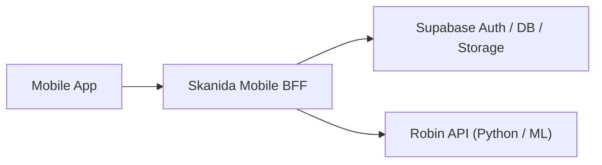

# Skanida Mobile BFF Implementation Handoff Plan

## 1. Purpose

This document is the implementation handoff for the new Skanida Mobile BFF repo.
It is written for engineers who will build the BFF service, not for stakeholders.
The goal is to remove product and architecture ambiguity so the implementer can scaffold
and ship the service without making system-design decisions on their own.

This plan assumes the current mobile app remains the system of record for UX flow, while
the new BFF becomes the owner of mobile-facing application logic and orchestration.

## 2. Locked Decisions

- Stack: Node 22 LTS, TypeScript, Hono, Docker-first runtime.
- Product scope: full mobile BFF, not a thin proxy and not architecture-only.
- Tenancy model: dedicated per school.
- Deployment unit: one school gets one BFF deployment, one Robin deployment, and one
  dedicated Supabase environment or project.
- Auth v1: mobile login stays direct to Supabase Auth. The mobile app calls BFF business
  APIs with the Supabase bearer token.
- Tenant resolution: deployment-local and server-owned. The client never sends a tenant id.
  The BFF maps each request to the deployment tenant using environment config after bearer
  token validation.
- Business logic ownership: BFF owns mobile-facing application logic from v1. Existing
  Supabase RPCs may be read for reference or reused only as persistence helpers, but they
  must not remain the primary decision engine for mobile flows.
- Storage baseline: BFF handles uploads and signed URLs through Supabase Storage. The actual
  storage layer may be backed by self-hosted S3-compatible storage behind Supabase.
- Robin topology: internal-only per deployment unit. The mobile app does not call Robin
  directly.
- Rollout: single cutover once the BFF is functionally complete and validated.
- Business timezone: `Asia/Jakarta` for v1. This is configurable later, but not part of
  the initial implementation scope.

## 3. Current Mobile State Snapshot

The new BFF must replace the following direct mobile dependencies and business decisions.

| Current mobile flow | Current file(s) | Current direct dependency | Target BFF endpoint |
| --- | --- | --- | --- |
| Dashboard aggregation and gating | `app/Dashboard.tsx` | Supabase tables, face runtime, enrollment checks, time sync | `GET /v1/mobile/dashboard` |
| Attendance precheck | `app/attendance/AbsenceReport.tsx` | device GPS, permit query, Supabase RPC `get_and_validate_attendance_action` | `POST /v1/mobile/attendance/precheck` |
| Attendance submit | `app/attendance/CameraAttendance.tsx` | Robin identify, Supabase RPC `save_attendance_record` | `POST /v1/mobile/attendance/submit` |
| Enrollment status | `utils/enrollment.ts` | Robin `/v1/enroll/status` | `GET /v1/mobile/face/enrollment/status` |
| Enrollment upload | `app/profile/enroll.tsx` | Robin `/v1/enroll` | `POST /v1/mobile/face/enrollment` |
| Permit list | `app/perizinan/status.tsx` | Supabase table reads | `GET /v1/mobile/permits` |
| Permit create | `app/perizinan/izin.tsx` | Supabase storage + table insert | `POST /v1/mobile/permits` |
| Profile read and avatar/password updates | `app/profile/ManageAccount.tsx` | Supabase profile/auth/storage | `GET /v1/mobile/profile`, `PATCH /v1/mobile/profile/avatar`, `PATCH /v1/mobile/profile/password` |
| Server time sync | `utils/timeSync.ts` | Supabase edge function + WorldTimeAPI fallback | `GET /v1/mobile/time` |

### Current behavior that must remain true after cutover

- Dashboard remains the first gate for server readiness and enrollment state before camera
  and location-heavy flows.
- Camera screens stay process-oriented. Dashboard or parent screens own success summary UX.
- Mobile-visible success messages stay minimal.
- Robin or Supabase internal table, bucket, or RPC names must not leak to mobile responses.
- Current payload guardrails remain at minimum:
  - Attendance image payload max: 5 MB base64 equivalent.
  - Enrollment capture: 10 images, 2 MB max per image.
  - Permit attachment image max: 10 MB.

## 4. Target Architecture



### 4.1 Service boundary

#### Mobile app

- Owns camera access, local file capture, GPS acquisition, navigation, progress UI, retry UI,
  and offline-friendly presentation logic.
- Knows only one API base URL for business flows.
- Keeps direct Supabase Auth login for v1.

#### BFF

- Owns mobile-facing application logic.
- Validates bearer tokens and resolves the authenticated user context.
- Performs all database reads and writes with service credentials after user authentication.
- Normalizes Robin, Supabase, and business-rule outcomes into stable mobile responses.
- Owns request validation, error taxonomy, rate limiting, timeouts, logging, and response envelopes.

#### Robin

- Owns ML pipeline only:
  - identify
  - enroll
  - enrollment status
  - liveness and readiness
- Validates the forwarded end-user bearer token again.
- Must remain non-public where possible.

#### Supabase

- Owns Auth, persistent data, and storage.
- BFF uses a service-role client for reads and writes after authenticating the user token.
- Storage stays behind BFF for avatars and permit attachments.

### 4.2 Deployment and tenancy baseline

- One school equals one deployment unit.
- Each deployment unit contains:
  - one BFF service
  - one Robin service
  - one dedicated Supabase environment or project
- No shared-tenant behavior is designed into v1 runtime behavior.
- The BFF must not trust hostnames, headers, or request payloads for tenant identity.
- Tenant identity is deployment-local through environment config:
  - `TENANT_KEY`
  - `TENANT_NAME`
  - school-specific Supabase and Robin endpoints

### 4.3 Runtime assumptions

- Node runtime: Node 22 LTS.
- Container runtime: Docker is the only required deployment baseline.
- Deployment adapters for ECS, EKS, EC2, and on-prem are documented as operational extensions.
- Robin is internal-only and reachable over private networking or deployment-local networking.
- Supabase may be managed or self-hosted.
- Object storage may be backed by S3-compatible storage behind Supabase Storage.
- BFF business time calculations use `Asia/Jakarta`.

## 5. Repo Baseline

The new repo must start with a ready-to-run service baseline, not a blank Hono skeleton.

### 5.1 Required runtime stack

- TypeScript
- Hono
- `@hono/node-server`
- `zod` for request and response schema validation
- `jose` for JWT verification
- `@supabase/supabase-js`
- `pino` for structured logging
- Native `fetch` for Robin integration
- `vitest` for tests
- `eslint` and `prettier`
- `tsx` for local development

### 5.2 Canonical package management and scripts

Use `npm` as the canonical package manager to simplify Docker and CI.

Required scripts:

- `npm run dev`
- `npm run build`
- `npm run start`
- `npm run typecheck`
- `npm run lint`
- `npm run test`
- `npm run test:integration`

### 5.3 File and module structure

The repo must use a module-oriented structure.

```text
src/
  app.ts
  index.ts
  config/
    env.ts
    tenant.ts
  middleware/
    auth.ts
    request-id.ts
    error-handler.ts
    rate-limit.ts
    timeout.ts
  clients/
    robin/
      client.ts
      schemas.ts
    supabase/
      auth.ts
      admin.ts
      storage.ts
  modules/
    attendance/
      routes.ts
      service.ts
      schema.ts
      mapper.ts
    dashboard/
      routes.ts
      service.ts
      schema.ts
    enrollment/
      routes.ts
      service.ts
      schema.ts
    permits/
      routes.ts
      service.ts
      schema.ts
    profile/
      routes.ts
      service.ts
      schema.ts
    time/
      routes.ts
      service.ts
    health/
      routes.ts
      service.ts
  lib/
    errors/
      codes.ts
      app-error.ts
    http/
      envelope.ts
      responses.ts
    logging/
      logger.ts
  routes/
    v1-mobile.ts
tests/
  unit/
  integration/
Dockerfile
compose.yaml
.env.example
README.md
```

### 5.4 Baseline deliverables

The initial repo must include:

- Hono application bootstrap
- Dockerfile
- Docker compose file for local BFF startup
- `.env.example`
- health endpoints
- request-id middleware
- auth middleware
- Robin client
- Supabase admin and storage clients
- test harness
- CI baseline for typecheck, lint, and tests

## 6. Common API Conventions

### 6.1 Base path

All mobile-facing endpoints live under:

```text
/v1/mobile
```

### 6.2 Response envelope

All success responses must use:

```json
{
  "success": true,
  "message": "Human-readable summary",
  "data": {},
  "meta": {
    "request_id": "uuid",
    "timestamp": "2026-04-21T10:00:00.000Z"
  }
}
```

All error responses must use:

```json
{
  "success": false,
  "error": {
    "code": "ERROR_CODE",
    "message": "Human-readable message",
    "details": {}
  },
  "meta": {
    "request_id": "uuid",
    "timestamp": "2026-04-21T10:00:00.000Z"
  }
}
```

### 6.3 Error code baseline

Use the following stable error codes:

- `AUTH_REQUIRED`
- `AUTH_INVALID`
- `FORBIDDEN`
- `VALIDATION_ERROR`
- `TENANT_MISMATCH`
- `ATTENDANCE_BLOCKED`
- `ENROLLMENT_REQUIRED`
- `DEPENDENCY_UNAVAILABLE`
- `UPSTREAM_TIMEOUT`
- `STORAGE_UPLOAD_FAILED`
- `RESOURCE_NOT_FOUND`
- `CONFLICT`
- `INTERNAL_ERROR`

### 6.4 Timeouts

- Robin readiness calls: 3000 ms
- Robin identify: 30000 ms
- Robin enrollment status: 5000 ms
- Robin enrollment upload: 60000 ms
- Supabase query default timeout: 5000 ms
- Storage upload timeout: 15000 ms

### 6.5 Rate limits

Use per-authenticated-user rate limiting with tenant-aware keys.

- `GET /v1/mobile/dashboard`: 60 requests per minute
- `POST /v1/mobile/attendance/precheck`: 12 requests per minute
- `POST /v1/mobile/attendance/submit`: 6 requests per minute
- `GET /v1/mobile/face/enrollment/status`: 30 requests per minute
- `POST /v1/mobile/face/enrollment`: 2 requests per 10 minutes
- `GET /v1/mobile/permits`: 30 requests per minute
- `POST /v1/mobile/permits`: 5 requests per hour
- `PATCH /v1/mobile/profile/avatar`: 10 requests per hour
- `PATCH /v1/mobile/profile/password`: 5 requests per hour
- `GET /v1/mobile/time`: 30 requests per minute

## 7. Public API Contract

### 7.1 `GET /v1/mobile/dashboard`

**Intent**

Return one normalized payload for the Dashboard screen, including gating decisions.

**Auth**

- Required

**Request**

- No request body

**Success response**

```json
{
  "success": true,
  "message": "Dashboard loaded.",
  "data": {
    "profile": {
      "user_id": "uuid",
      "full_name": "Student Name",
      "email": "student@example.com",
      "nis": "12345",
      "class_name": "X-A",
      "absence_number": "07",
      "avatar_url": "https://signed-url",
      "role": "siswa"
    },
    "attendance": {
      "today_status": "pending",
      "has_checked_in": false,
      "has_checked_out": false,
      "check_in_time": null,
      "check_out_time": null,
      "total_work_hours": null
    },
    "schedule": {
      "day_key": "senin",
      "start_check_in_at": "2026-04-21T00:00:00.000Z",
      "end_check_in_at": "2026-04-21T01:30:00.000Z",
      "start_check_out_at": "2026-04-21T08:00:00.000Z",
      "end_check_out_at": "2026-04-21T09:00:00.000Z",
      "compensation_minutes": 0
    },
    "face": {
      "server_status": "healthy",
      "enrollment_status": "enrolled",
      "message": "Ready"
    },
    "permit": {
      "has_active_permit": false,
      "active_category": null
    },
    "primary_action": {
      "allowed": true,
      "type": "check_in",
      "label": "PRESENSI",
      "reason_code": null,
      "reason_message": null
    },
    "server_time": {
      "now": "2026-04-21T00:10:00.000Z",
      "timezone": "Asia/Jakarta",
      "source": "bff"
    }
  },
  "meta": {
    "request_id": "uuid",
    "timestamp": "2026-04-21T00:10:00.000Z"
  }
}
```

**Validation and rules**

- User identity comes from bearer token only.
- All fields are derived server-side.
- `primary_action` is computed in BFF and becomes the source of truth for Dashboard gating.
- `avatar_url` must be a signed URL when an avatar exists.
- Do not expose Robin dependency internals beyond normalized status and message.

**Downstream dependencies**

- Supabase `user_profiles`
- Supabase `absences`
- Supabase `perizinan`
- Supabase `jadwal_absensi`
- Supabase Storage for signed avatar URL
- Robin readiness
- Robin enrollment status

**Failure behavior**

- `401 AUTH_REQUIRED` or `AUTH_INVALID`
- `503 DEPENDENCY_UNAVAILABLE` when Robin or Supabase is not usable
- `500 INTERNAL_ERROR` for unexpected failures

### 7.2 `POST /v1/mobile/attendance/precheck`

**Intent**

Perform all attendance gating before the mobile app opens the camera submission flow.

**Auth**

- Required

**Request**

```json
{
  "latitude": -7.123456,
  "longitude": 112.123456
}
```

**Success response**

```json
{
  "success": true,
  "message": "Attendance precheck completed.",
  "data": {
    "allowed": true,
    "action_type": "check_in",
    "location_name": "Sekolah Utama",
    "schedule_window": {
      "start_at": "2026-04-21T00:00:00.000Z",
      "end_at": "2026-04-21T01:30:00.000Z"
    },
    "checks": {
      "schedule": "pass",
      "permit": "pass",
      "enrollment": "pass",
      "robin": "pass"
    },
    "blocking_reason": null
  },
  "meta": {
    "request_id": "uuid",
    "timestamp": "2026-04-21T00:10:00.000Z"
  }
}
```

**Validation and rules**

- `latitude` and `longitude` are required numeric values.
- BFF re-implements attendance decision rules instead of delegating the full decision to
  current Supabase RPCs.
- BFF checks, in order:
  1. authenticated user exists
  2. no active permit for the current business day
  3. current schedule allows an attendance action
  4. Robin readiness is healthy
  5. enrollment status is `enrolled`
- Return `allowed=false` with a normalized blocking reason instead of exposing raw RPC errors.

**Downstream dependencies**

- Supabase `perizinan`
- Supabase `absences`
- Supabase `jadwal_absensi`
- Robin readiness
- Robin enrollment status

**Failure behavior**

- `409 ATTENDANCE_BLOCKED`
- `503 DEPENDENCY_UNAVAILABLE`
- `504 UPSTREAM_TIMEOUT`

### 7.3 `POST /v1/mobile/attendance/submit`

**Intent**

Submit attendance after camera capture by combining business validation, Robin identify,
and persistence into one API.

**Auth**

- Required

**Request**

```json
{
  "action_type": "check_in",
  "image_base64": "base64-encoded-image",
  "latitude": -7.123456,
  "longitude": 112.123456
}
```

**Success response**

```json
{
  "success": true,
  "message": "Attendance recorded.",
  "data": {
    "attendance_type": "check_in",
    "status_label": "Hadir",
    "processed_ms": 1843
  },
  "meta": {
    "request_id": "uuid",
    "timestamp": "2026-04-21T00:10:00.000Z"
  }
}
```

**Validation and rules**

- `action_type` enum: `check_in` or `check_out`
- `image_base64` max decoded size: 5 MB
- `latitude` and `longitude` required
- BFF repeats the same gating checks as precheck before persisting any attendance outcome
- BFF forwards the authenticated bearer token and request id to Robin identify
- Only after Robin identify succeeds may attendance be saved
- Duplicate or invalid attendance actions must return `409 ATTENDANCE_BLOCKED`
- The mobile response must not include Robin confidence, recognized identity details, or raw
  storage and database internals

**Downstream dependencies**

- Robin `POST /v1/identify`
- Supabase data persistence for `absences`
- Existing Supabase helper function or transaction layer only if needed for atomic write

**Failure behavior**

- `409 ATTENDANCE_BLOCKED`
- `503 DEPENDENCY_UNAVAILABLE`
- `504 UPSTREAM_TIMEOUT`
- `422 VALIDATION_ERROR`

### 7.4 `GET /v1/mobile/face/enrollment/status`

**Intent**

Return a mobile-friendly enrollment status.

**Auth**

- Required

**Request**

- No request body

**Success response**

```json
{
  "success": true,
  "message": "Enrollment status loaded.",
  "data": {
    "status": "enrolled",
    "embedding_count": 10,
    "message": "Ready"
  },
  "meta": {
    "request_id": "uuid",
    "timestamp": "2026-04-21T00:10:00.000Z"
  }
}
```

**Validation and rules**

- BFF forwards the end-user bearer token to Robin.
- `404` or "not found" from Robin becomes `status=not_enrolled`, not an internal error.
- Robin dependency failures become `503 DEPENDENCY_UNAVAILABLE`.

**Downstream dependencies**

- Robin `GET /v1/enroll/status`

**Failure behavior**

- `503 DEPENDENCY_UNAVAILABLE`
- `504 UPSTREAM_TIMEOUT`

### 7.5 `POST /v1/mobile/face/enrollment`

**Intent**

Upload enrollment photos and normalize Robin enrollment behavior into a stable mobile contract.

**Auth**

- Required

**Request**

- `multipart/form-data`
- field name: `files`
- required file count: exactly 10
- max file size: 2 MB per file

**Success response**

```json
{
  "success": true,
  "message": "Enrollment completed.",
  "data": {
    "images_processed": 10,
    "images_failed": 0,
    "total_embeddings": 10
  },
  "meta": {
    "request_id": "uuid",
    "timestamp": "2026-04-21T00:10:00.000Z"
  }
}
```

**Validation and rules**

- Exactly 10 files are required in v1 to mirror current mobile behavior.
- Accept JPEG images only.
- BFF forwards the end-user bearer token and request id to Robin.
- Robin response is normalized before returning to mobile.

**Downstream dependencies**

- Robin `POST /v1/enroll`

**Failure behavior**

- `422 VALIDATION_ERROR`
- `503 DEPENDENCY_UNAVAILABLE`
- `504 UPSTREAM_TIMEOUT`

### 7.6 `GET /v1/mobile/permits`

**Intent**

Return permit history for the authenticated user.

**Auth**

- Required

**Request**

- No request body

**Success response**

```json
{
  "success": true,
  "message": "Permits loaded.",
  "data": {
    "items": [
      {
        "id": "uuid",
        "category": "sakit",
        "description": "Flu",
        "approval_status": "pending",
        "date": "2026-04-21T00:00:00.000Z",
        "created_at": "2026-04-21T00:10:00.000Z",
        "attachment_url": "https://signed-url",
        "rejection_reason": null,
        "rejected_at": null
      }
    ]
  },
  "meta": {
    "request_id": "uuid",
    "timestamp": "2026-04-21T00:10:00.000Z"
  }
}
```

**Validation and rules**

- Read permits only for the authenticated user.
- Return signed URLs for attachments, never raw storage paths.
- Preserve historical categories in reads even if v1 create is limited to current app categories.

**Downstream dependencies**

- Supabase `perizinan`
- Supabase Storage signed URLs for the `perizinan` bucket

**Failure behavior**

- `401 AUTH_REQUIRED`
- `500 INTERNAL_ERROR`

### 7.7 `POST /v1/mobile/permits`

**Intent**

Create a new permit request and move storage logic out of the mobile app.

**Auth**

- Required

**Request**

- `multipart/form-data`
- required fields:
  - `category`
  - `description`
  - `date`
- optional file field:
  - `attachment`

**Validation and rules**

- `category` enum for create in v1:
  - `sakit`
  - `pergi`
- `description` length: 10 to 500 characters
- attachment max size: 10 MB
- uploaded objects are stored under the authenticated user id path
- BFF generates the storage object key, uploads the file, generates signed URLs, and inserts
  the permit record
- client-supplied storage paths are forbidden

**Success response**

```json
{
  "success": true,
  "message": "Permit submitted.",
  "data": {
    "id": "uuid",
    "category": "sakit",
    "approval_status": "pending"
  },
  "meta": {
    "request_id": "uuid",
    "timestamp": "2026-04-21T00:10:00.000Z"
  }
}
```

**Downstream dependencies**

- Supabase Storage `perizinan` bucket
- Supabase `perizinan`

**Failure behavior**

- `422 VALIDATION_ERROR`
- `409 CONFLICT`
- `502 STORAGE_UPLOAD_FAILED`

### 7.8 `GET /v1/mobile/profile`

**Intent**

Return the authenticated user profile used by the mobile app.

**Auth**

- Required

**Success response**

```json
{
  "success": true,
  "message": "Profile loaded.",
  "data": {
    "user_id": "uuid",
    "full_name": "Student Name",
    "email": "student@example.com",
    "nis": "12345",
    "class_name": "X-A",
    "absence_number": "07",
    "avatar_url": "https://signed-url",
    "role": "siswa",
    "gender": "male"
  },
  "meta": {
    "request_id": "uuid",
    "timestamp": "2026-04-21T00:10:00.000Z"
  }
}
```

**Downstream dependencies**

- Supabase `user_profiles`
- Supabase Storage signed avatar URL

### 7.9 `PATCH /v1/mobile/profile/avatar`

**Intent**

Upload, replace, or clear the user avatar through the BFF.

**Auth**

- Required

**Request**

Two supported modes:

1. `multipart/form-data` with `file`
2. `application/json` with:

```json
{
  "clear": true
}
```

**Validation and rules**

- Avatar upload max size: 5 MB
- Allowed content types: `image/jpeg`, `image/png`, `image/webp`
- BFF stores avatar under a deterministic path scoped to the authenticated user
- On upload, BFF updates both:
  - Supabase auth metadata `avatar_url`
  - Supabase `user_profiles.avatar_url`
- On clear, BFF removes the same fields from auth metadata and profile table

**Success response**

```json
{
  "success": true,
  "message": "Avatar updated.",
  "data": {
    "avatar_url": "https://signed-url-or-null"
  },
  "meta": {
    "request_id": "uuid",
    "timestamp": "2026-04-21T00:10:00.000Z"
  }
}
```

**Downstream dependencies**

- Supabase Storage `avatars`
- Supabase auth admin update
- Supabase `user_profiles`

**Failure behavior**

- `422 VALIDATION_ERROR`
- `502 STORAGE_UPLOAD_FAILED`

### 7.10 `PATCH /v1/mobile/profile/password`

**Intent**

Change the authenticated user's password through BFF-owned validation.

**Auth**

- Required

**Request**

```json
{
  "current_password": "old-password",
  "new_password": "new-password"
}
```

**Validation and rules**

- `current_password` and `new_password` are required
- `new_password` min length: 8
- BFF verifies the current password against Supabase Auth before changing it
- BFF uses admin update after successful verification

**Success response**

```json
{
  "success": true,
  "message": "Password updated.",
  "data": {},
  "meta": {
    "request_id": "uuid",
    "timestamp": "2026-04-21T00:10:00.000Z"
  }
}
```

**Failure behavior**

- `401 AUTH_INVALID`
- `422 VALIDATION_ERROR`
- `500 INTERNAL_ERROR`

### 7.11 `GET /v1/mobile/time`

**Intent**

Provide the canonical business time for the mobile app.

**Auth**

- Required

**Success response**

```json
{
  "success": true,
  "message": "Server time loaded.",
  "data": {
    "now": "2026-04-21T00:10:00.000Z",
    "timezone": "Asia/Jakarta",
    "source": "bff"
  },
  "meta": {
    "request_id": "uuid",
    "timestamp": "2026-04-21T00:10:00.000Z"
  }
}
```

**Validation and rules**

- BFF becomes the canonical time source for the mobile app.
- No fallback to public time APIs in the mobile app after cutover.

### 7.12 `GET /v1/mobile/health`

**Intent**

Expose a minimal mobile-safe health signal without leaking internal dependency detail.

**Auth**

- Not required

**Success response**

```json
{
  "success": true,
  "message": "Service healthy.",
  "data": {
    "status": "healthy"
  },
  "meta": {
    "request_id": "uuid",
    "timestamp": "2026-04-21T00:10:00.000Z"
  }
}
```

**Validation and rules**

- This endpoint returns minimal information only.
- Do not include Robin, model, Qdrant, Supabase, or storage implementation details in the body.

**Failure behavior**

- `503 DEPENDENCY_UNAVAILABLE`

## 8. Internal Service Contracts

### 8.1 BFF to Robin

Robin endpoints consumed by BFF:

- `GET /live`
- `GET /ready`
- `GET /health`
- `POST /v1/identify`
- `GET /v1/enroll/status`
- `POST /v1/enroll`

#### Robin request rules

- Forward the end-user bearer token unchanged in `Authorization`.
- Forward `X-Request-ID` for trace correlation.
- Do not expose Robin directly to the mobile app.
- Network path should stay internal to the deployment unit.

#### Robin normalization rules

- Robin dependency failures become `503 DEPENDENCY_UNAVAILABLE`
- Robin timeouts become `504 UPSTREAM_TIMEOUT`
- Robin enrollment `404` becomes a normalized `not_enrolled` business response
- Robin success details are trimmed to mobile-safe fields only

### 8.2 BFF to Supabase

#### Auth verification

- Verify Supabase bearer tokens in BFF using `jose`
- Validation order:
  1. verify signature against configured JWKS or JWT secret
  2. validate issuer and audience
  3. extract `sub` as authenticated user id
- BFF then loads the user profile and deployment tenant context using service credentials
- The client never supplies `user_id` in business requests

#### Data access

- Use service-role credentials for all BFF data reads and writes after authentication
- Required data sources in v1:
  - `user_profiles`
  - `absences`
  - `perizinan`
  - `jadwal_absensi`
- Existing RPCs may be used only as optional persistence helpers if needed for atomic writes.
- Existing RPCs must not remain the primary business-rule engine for attendance or dashboard gating.

#### Storage

- Required buckets in v1:
  - `avatars`
  - `perizinan`
- BFF generates storage keys and signed URLs
- Mobile never receives raw storage paths

## 9. Security and Operations

### 9.1 Auth and authorization

- Bearer token verification in BFF is the primary security boundary for business APIs.
- Robin must also verify the forwarded bearer token.
- BFF authorizes all reads and writes based on authenticated user id, not client payloads.

### 9.2 CORS

- Only allow configured mobile origins and local development origins.
- No wildcard with credentialed origins.

### 9.3 Logging

- Use structured logs with `pino`
- Include:
  - request id
  - tenant key
  - user id when authenticated
  - route
  - duration
  - downstream target
  - error code
- Never log:
  - access tokens
  - raw base64 images
  - passwords
  - full personally sensitive attachments

### 9.4 Health semantics

Required service health endpoints outside the mobile namespace:

- `GET /live`
  - process-only liveness
  - no downstream checks
- `GET /ready`
  - dependency-aware readiness
  - checks Supabase connectivity and Robin readiness
- `GET /v1/mobile/health`
  - mobile-safe health signal
  - minimal body, no internal detail

### 9.5 Required configuration inventory

- `NODE_ENV`
- `PORT`
- `LOG_LEVEL`
- `SERVICE_NAME`
- `TENANT_KEY`
- `TENANT_NAME`
- `BUSINESS_TIMEZONE`
- `CORS_ALLOWED_ORIGINS`
- `SUPABASE_URL`
- `SUPABASE_SERVICE_ROLE_KEY`
- `SUPABASE_JWT_SECRET` or `SUPABASE_JWKS_URL`
- `SUPABASE_JWT_ISSUER`
- `SUPABASE_JWT_AUDIENCE`
- `SUPABASE_STORAGE_BUCKET_AVATARS`
- `SUPABASE_STORAGE_BUCKET_PERMITS`
- `ROBIN_BASE_URL`
- `ROBIN_READY_TIMEOUT_MS`
- `ROBIN_IDENTIFY_TIMEOUT_MS`
- `ROBIN_ENROLL_TIMEOUT_MS`

## 10. Implementation Order

### Phase 0: bootstrap

- scaffold Hono app
- add env config and validation
- add Dockerfile, compose, CI baseline
- add logging, request-id, error envelope, and health routes

### Phase 1: foundation

- implement auth middleware
- implement Supabase auth and admin clients
- implement Robin client
- implement tenant config and server-owned tenant resolution

### Phase 2: attendance and dashboard

- implement dashboard aggregation
- implement attendance precheck
- implement attendance submit
- remove direct Robin and Supabase attendance dependencies from mobile

### Phase 3: enrollment

- implement enrollment status facade
- implement enrollment upload facade
- remove direct enrollment calls from mobile

### Phase 4: permits, profile, and time

- implement permit list and create
- implement profile read
- implement avatar update and clear
- implement password change
- implement time endpoint

### Phase 5: hardening and cutover

- run end-to-end validation against a school-specific environment
- confirm Docker runtime works with school-specific env config
- switch mobile environment to BFF base URL

## 11. Migration and Single-Cutover Checklist

Before mobile cutover:

- BFF endpoint parity is complete for dashboard, attendance, enrollment, permits, profile,
  and time sync
- mobile no longer requires Robin base URL
- mobile no longer reads or writes business tables or storage directly
- mobile no longer depends on Supabase RPC names for attendance
- Robin internal connectivity from BFF is healthy
- Supabase connectivity from BFF is healthy
- Storage upload and signed URL flows are verified
- request id correlation is visible across BFF and Robin logs
- one school-specific Docker deployment has passed acceptance testing

Mobile changes required for cutover:

- keep Supabase Auth login
- replace Dashboard data loading with `GET /v1/mobile/dashboard`
- replace attendance precheck with `POST /v1/mobile/attendance/precheck`
- replace attendance submit with `POST /v1/mobile/attendance/submit`
- replace enrollment calls with BFF endpoints
- replace permit and profile direct storage/database calls with BFF endpoints
- replace time sync source with `GET /v1/mobile/time`

## 12. Testing Plan

### 12.1 Unit tests

- auth middleware:
  - missing token
  - invalid token
  - valid token
- tenant resolution:
  - correct deployment tenant
  - mismatched or missing tenant config
- request validation:
  - attendance payload over 5 MB
  - enrollment file count not equal to 10
  - permit description length invalid
  - avatar clear payload and multipart payload
- response normalization:
  - Robin not enrolled
  - Robin timeout
  - Robin dependency unavailable
- business rules:
  - active permit blocks attendance
  - schedule outside window blocks attendance
  - unenrolled face state blocks attendance

### 12.2 Integration tests

- Robin client:
  - readiness success
  - identify success
  - identify timeout
  - enroll status not found
  - enroll upload success and failure
- Supabase client:
  - profile read
  - avatar signed URL generation
  - permit insert
  - attendance persistence
- endpoint-level integration:
  - dashboard happy path
  - attendance precheck blocked by permit
  - attendance submit happy path
  - attendance submit blocked before persistence
  - permit create with attachment
  - avatar upload and clear

### 12.3 Cutover validation

- Dashboard still acts as the first gate before camera flow
- Attendance success still returns only minimal completion data
- Enrollment UI behavior remains compatible with 10-photo capture flow
- Permit history and creation work without direct storage access from mobile
- Password change flow works without mobile calling Supabase auth mutation directly
- A school-specific Docker deployment runs without cross-school assumptions

## 13. Acceptance Criteria

The `plan.md` handoff is acceptable only if:

- an implementer can scaffold the repo without deciding architecture boundaries
- an implementer can build all v1 endpoints without deciding ownership between BFF,
  Robin, and Supabase
- an implementer knows the exact repo structure, runtime baseline, scripts, health behavior,
  and env inventory
- an implementer knows the exact public endpoint surface and common error envelope
- an implementer knows the single-cutover target state for the mobile app

## 14. Future Extensions, Explicitly Not in v1

- shared multi-tenant runtime
- public Robin exposure
- storage provider abstraction outside Supabase-managed access
- direct support for multiple business timezones
- platform-specific deployment templates beyond Docker baseline
